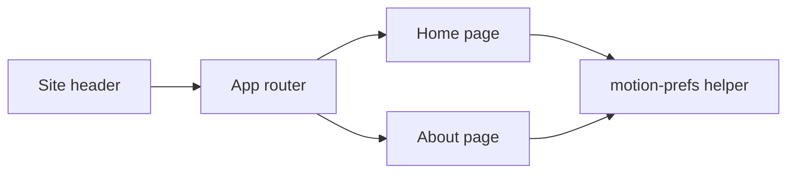

# 08-motion-landing architecture

Marketing shell with React Router and Framer Motion layout transitions.

```mermaid
flowchart LR
  header[Site header]
  router[App router]
  home[Home page]
  about[About page]
  motion[motion-prefs helper]
  header --> router
  router --> home
  router --> about
  home --> motion
  about --> motion
```

Port **5008**; federation remote `motionLanding/App`.
